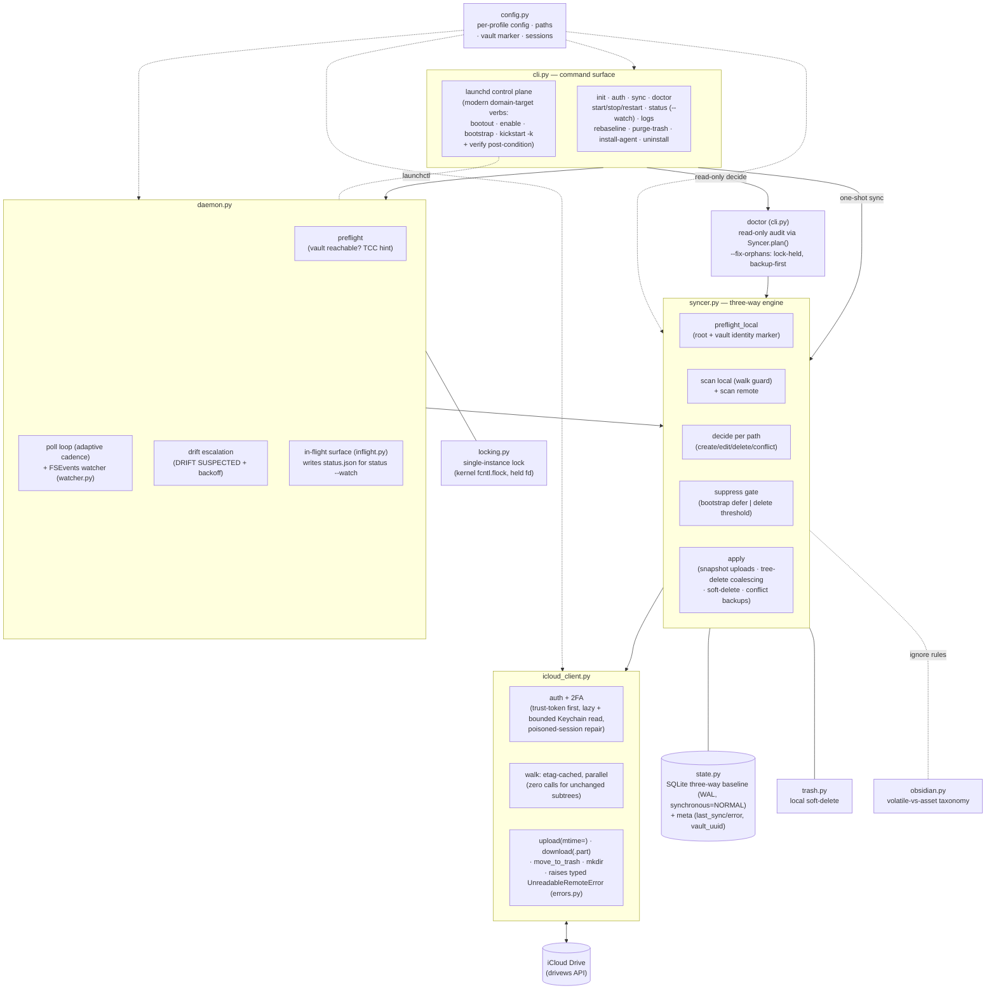
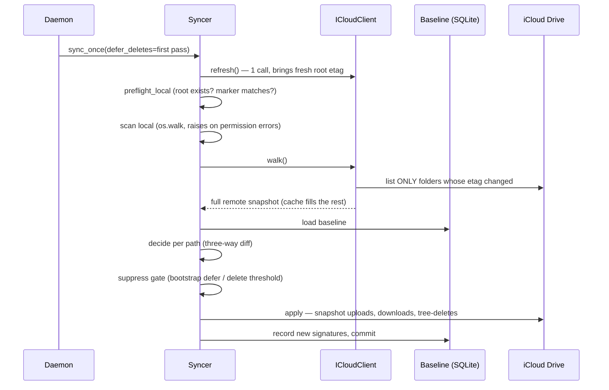

# ifolder-sync — Architecture

A macOS daemon that bidirectionally syncs one folder of a **specific iCloud Drive
account** (via the unofficial `pyicloud` web API, not the system iCloud client) with a
local folder — designed for Obsidian vaults used across devices.

## Component map



## One sync pass



The **decide → apply split** is deliberate: it enables `--dry-run` (decide, don't
apply), the delete threshold (count deletions before acting), deletion coalescing, and
soft-delete routing.

## The three-way baseline

For every path the baseline stores the (size, mtime) signature of **both sides as they
were at the last successful sync**. That is what distinguishes:

| Observation | Two-way diff says | Three-way baseline says |
|---|---|---|
| File only on remote | "download it" | *was it here before?* in baseline → **deleted locally** → delete remote; not in baseline → **new** → download |
| File differs on both sides | ambiguous | changed vs baseline on both → **conflict** (policy `newer` resolves; loser kept as `.conflict-<ts>` locally, never synced) |

Directories follow the same rule (a dir known to the baseline but missing on one side
is a deletion in progress, never recreated).

## Safety model (defense in depth)

Ordered from prevention to recovery; each layer was motivated by a real incident:

1. **Walk guards, both sides** — a failed/partial scan (network error, macOS TCC
   permission denial) aborts the pass with zero actions. A partial tree is
   indistinguishable from mass deletion, so the engine never looks at one.
2. **Vault identity marker** — `.ifolder-sync-vault` (local-only, engine-ignored) ties
   a non-empty baseline to its folder; a moved/recreated vault stops the daemon
   instead of generating phantom deletions.
3. **Bootstrap additive pass** — the first pass after start transfers content but
   defers all deletions to the next pass.
4. **Propagation-lag guards** — iCloud can publish a file's *record* before its *body*
   propagates over the web API. Two shapes, both deferred rather than judged: a 0-byte
   remote record shadowing a non-empty local file waits `settle_max_passes` (the settle
   guard); a record that lists size N > 0 but whose body fetches as 0 bytes raises the
   typed `UnreadableRemoteError` (`errors.py`) and is deferred — counted as `pending`,
   never an error, the baseline left untouched, and a conflict is **never** resolved
   against it (`_resolve_conflict` probes readability first, for every policy). It is
   retried each pass until it heals; only after `unreadable_max_passes` against an
   unchanged remote signature is it judged a genuine empty husk and the good side allowed
   to win (one warning). The earlier "resolve without backup" heal path was removed — it
   was a data-loss clobber of an in-flight edit from another device.
5. **Delete threshold** — a pass deleting more than `delete_threshold_pct`/`_count`
   skips all deletions unless `--force-delete`; repeated trips raise `DRIFT SUSPECTED`
   and slow polling.
6. **Snapshot uploads** — the engine uploads a frozen copy and records *its*
   signature, so editor autosaves mid-pass cannot create conflict loops (TOCTOU).
7. **Soft deletes everywhere** — local deletions go to a trash outside the vault;
   remote deletions go to iCloud's Recently Deleted (a coalesced subtree arrives there
   as a single restorable folder).
8. **Recovery: `rebaseline`** — backup + empty baseline; the next pass is purely
   additive (downloads + uploads, never deletes).

## Performance model

Verified empirically (2026-06-10): **iCloud folder etags fingerprint the whole
subtree** — a descendant edit bumps every ancestor's etag up to the root, while
untouched folders stay byte-stable. The walk exploits this:

- root etag unchanged → entire vault unchanged → a no-op pass costs ~1 call;
- changed paths re-list only the folders along them (parallel, `walk_workers`);
- a full uncached walk runs every `full_walk_interval_seconds` as ground truth, and
  any cache inconsistency drops the whole cache (the engine never guesses).

Polling is adaptive: `interval_active_seconds` while changes flowed recently,
`interval_seconds` when idle; the local watcher reacts to local edits in ~3s.

Three engine-level economies keep the steady state cheap:

- **Idle-pass dedup** — an in-sync pass re-`RECORD`s every path with the value it
  already holds; `state.py` skips a byte-identical baseline rewrite (a dirty flag, set
  only by a real write), so an idle pass commits nothing and an unchanged vault costs
  no DB write.
- **Precompiled ignore matching** — the `ignore` set is compiled once at `Syncer` init
  (`fnmatch.translate` → one regex per pattern) instead of re-translating per path; the
  hot scan loop (local walk + remote walk + watcher, all via `Syncer._ignored`) only
  runs the precompiled matchers.
- **Cheaper baseline commits** — the baseline runs SQLite WAL with
  `synchronous=NORMAL`, so each per-op commit (one per applied action, for
  SIGKILL-mid-pass crash safety) is a WAL append rather than a full fsync.

## Single-instance lock

`locking.py` guarantees exactly one process writes a profile's baseline at a time. The
lock is a **kernel advisory lock** (`fcntl.flock`) held on a file descriptor kept open
for the whole process lifetime (`state/<name>/daemon.lock`, `0600`, owner-only). The
kernel releases the lock on **any** process exit — clean, crash, or `SIGKILL` — so a
dead holder's lock is freed instantly with no liveness heuristic: there is no
stale-reclaim, no pidfile-staleness check, no boot-time comparison. The pid written into
the file body is a human-readable label only, never a liveness input (flock
acquirability is the sole authority). The baseline-writing CLI commands (`sync`,
`doctor --fix-orphans`, `rebaseline`) hold this same lock for the whole write, so a
manual command can never race a live daemon's baseline.

The lock file must live on a **local filesystem** (here APFS under `$HOME`): flock
semantics are unreliable over NFS/SMB. One upgrade consequence: a daemon started by a
pre-flock build holds the lock file *without* a kernel flock, so a new-code process
cannot see it — after upgrading, `ifolder-sync restart` each active profile so the new
code takes the kernel lock.

## Control plane & observability

The `start`/`stop`/`restart`/`uninstall` commands and `status --watch` are the
operator surface around the launchd-managed daemon.

**Modern launchd control plane.** Lifecycle commands drive launchd through the modern
domain-target verbs (`bootout` / `enable` / `bootstrap` / `kickstart -k` against
`gui/<uid>/com.ifolder-sync.<profile>`), not the legacy `load`/`unload`. Every command
then **verifies its post-condition** — it polls `launchctl print` until the daemon is
actually up (or down) before reporting success, so a throttled-but-fine spawn never
reads as a false "failed to start" and a slow teardown is never falsely reported
"stopped". `restart` is a first-class atomic verb (not `stop && start`): it regenerates
the plist, boots out the old job, waits for that async bootout to settle, enables the
label, bootstraps with bounded retry, then `kickstart -k`s a fresh spawn — it never
ends with the daemon stopped. `uninstall` stops the job and removes the `.plist`
(idempotent). The plist's `ThrottleInterval` is `Config.throttle_interval_seconds`;
because launchd throttles a fresh spawn up to that window, the start/restart verify wait
is floored at the throttle plus a small buffer.

**Live status dashboard.** When `inflight_surface` is on, the daemon (and a foreground
`sync`) writes an atomic `status.json` snapshot of the transfers it is moving right now,
coalesced to at most one write per `inflight_min_write_interval_ms`. `status --watch`
polls that snapshot (every `dashboard_interval_seconds`) to render in-flight transfers,
the full pending queue, recently-synced and flapping paths, across all profiles, with
optional `rich` rendering. The snapshot lives next to but separate from
`baseline.sqlite3` (no lock/WAL contention) and a torn write lands as a `.part` that the
engine hard-ignores, so it can never sync. The observer trusts the snapshot only when
its `pid` matches the current lock holder; otherwise it falls back to the read-only meta
fold (the persisted stuck registries) it reads through a `mode=ro` connection.

**Sync doctor.** `doctor` is the read-only counterpart of a sync pass: it runs the
engine's decide phase with no apply (`Syncer.plan()`) and reports inconsistencies —
orphan baseline rows, planned uploads/downloads/deletes, would-be conflicts, unsettled
paths — changing no local, remote, or baseline state. `doctor --fix-orphans` is the one
opt-in write: it drops only the provably-orphan baseline rows (present in the baseline,
absent from a *successful* local+remote scan), backing up the baseline first and holding
the single-instance lock for the write. `plan()` raises on any scan failure, so
`--fix-orphans` can never act on a partial scan.

## Process & data layout

```
~/.config/ifolder-sync/
  profiles/<name>.json        one config per profile (a profile = one folder pair)
  state/<name>/               baseline.sqlite3 · trash/ · daemon.lock · status.json · logs/
  state/sessions/             iCloud sessions (0700/0600), shared, keyed by Apple ID
~/Library/LaunchAgents/
  com.ifolder-sync.<name>.plist   launchd agent (KeepAlive SuccessfulExit=false)
```

Each profile is fully isolated (own baseline/trash/lock/agent); sessions are shared
per Apple ID so one 2FA covers all profiles of an account. The daemon runs under
launchd: crash → restart (throttled); deliberate stop (failed preflight/auth) → clean
exit, **no** restart loop.

## Known constraints

- The vault must not live under `~/Downloads`, `~/Desktop` or `~/Documents`: macOS TCC
  blocks launchd daemons from those folders (a Terminal-started daemon works, masking
  the problem). `init`/`start --background` warn about this.
- Plugin hot-state files (`plugins/*/data.json`) are per-device and rewritten on nearly
  every launch; they are excluded from sync automatically under `obsidian: true`
  (`manifest.json` and the plugin code still sync).
- Devices syncing through Apple's native iCloud (iPhone Obsidian) propagate on Apple's
  schedule; opening the app forces a pull and can briefly expose the publish-before-
  content window (a record visible before its body), which the engine defers rather than
  errors (see the safety model's propagation-lag guards).
- The pyicloud web API is reverse-engineered and can break when Apple changes it.
- **Advanced Data Protection (ADP) is incompatible**: enabling ADP on the Apple ID
  ends web-API access to iCloud Drive entirely — this affects every tool in this
  space (pyicloud, rclone's iclouddrive backend, all forks), not just this one.
