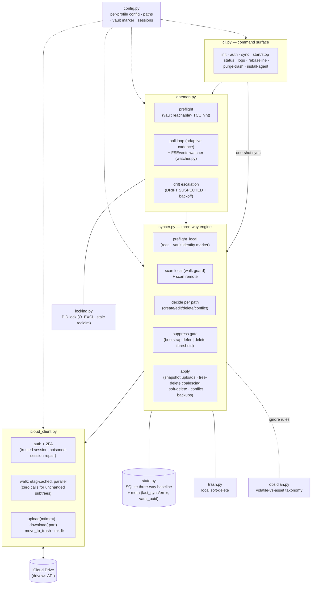
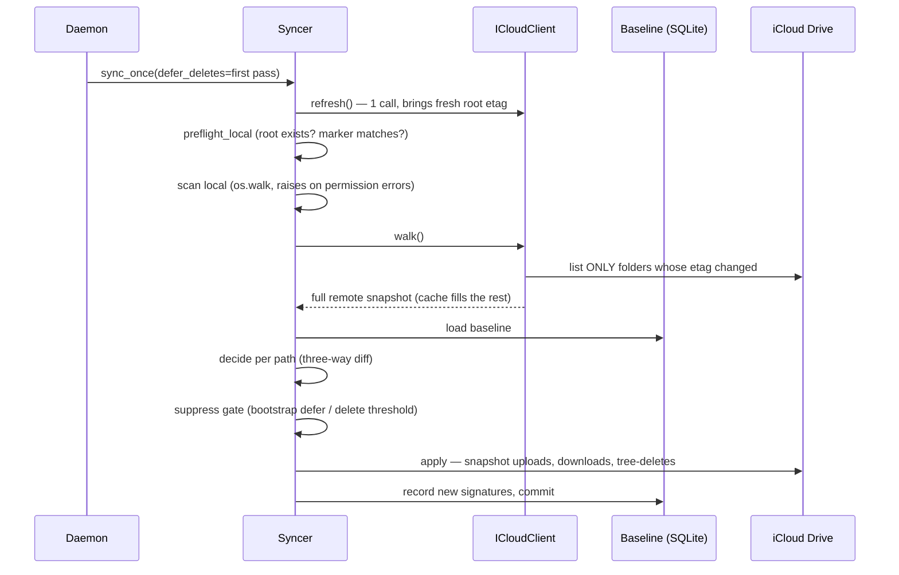

# ifolder-sync — Architecture

A macOS daemon that bidirectionally syncs one folder of a **specific iCloud Drive
account** (via the unofficial `pyicloud` web API, not the system iCloud client) with a
local folder — designed for Obsidian vaults used across devices.

## Component map



## One sync pass



The **decide → apply split** is deliberate: it enables `--dry-run` (decide, don't
apply), the delete threshold (count deletions before acting), deletion coalescing, and
soft-delete routing.

## The three-way baseline

For every path the baseline stores the (size, mtime) signature of **both sides as they
were at the last successful sync**. That is what distinguishes:

| Observation | Two-way diff says | Three-way baseline says |
|---|---|---|
| File only on remote | "download it" | *was it here before?* in baseline → **deleted locally** → delete remote; not in baseline → **new** → download |
| File differs on both sides | ambiguous | changed vs baseline on both → **conflict** (policy `newer` resolves; loser kept as `.conflict-<ts>` locally, never synced) |

Directories follow the same rule (a dir known to the baseline but missing on one side
is a deletion in progress, never recreated).

## Safety model (defense in depth)

Ordered from prevention to recovery; each layer was motivated by a real incident:

1. **Walk guards, both sides** — a failed/partial scan (network error, macOS TCC
   permission denial) aborts the pass with zero actions. A partial tree is
   indistinguishable from mass deletion, so the engine never looks at one.
2. **Vault identity marker** — `.ifolder-sync-vault` (local-only, engine-ignored) ties
   a non-empty baseline to its folder; a moved/recreated vault stops the daemon
   instead of generating phantom deletions.
3. **Bootstrap additive pass** — the first pass after start transfers content but
   defers all deletions to the next pass.
4. **Settle guard** — a both-sides-create conflict against a 0-byte remote husk
   (iCloud publishes records before content) waits one pass instead of judging.
5. **Delete threshold** — a pass deleting more than `delete_threshold_pct`/`_count`
   skips all deletions unless `--force-delete`; repeated trips raise `DRIFT SUSPECTED`
   and slow polling.
6. **Snapshot uploads** — the engine uploads a frozen copy and records *its*
   signature, so editor autosaves mid-pass cannot create conflict loops (TOCTOU).
7. **Soft deletes everywhere** — local deletions go to a trash outside the vault;
   remote deletions go to iCloud's Recently Deleted (a coalesced subtree arrives there
   as a single restorable folder).
8. **Recovery: `rebaseline`** — backup + empty baseline; the next pass is purely
   additive (downloads + uploads, never deletes).

## Performance model

Verified empirically (2026-06-10): **iCloud folder etags fingerprint the whole
subtree** — a descendant edit bumps every ancestor's etag up to the root, while
untouched folders stay byte-stable. The walk exploits this:

- root etag unchanged → entire vault unchanged → a no-op pass costs ~1 call;
- changed paths re-list only the folders along them (parallel, `walk_workers`);
- a full uncached walk runs every `full_walk_interval_seconds` as ground truth, and
  any cache inconsistency drops the whole cache (the engine never guesses).

Polling is adaptive: `interval_active_seconds` while changes flowed recently,
`interval_seconds` when idle; the local watcher reacts to local edits in ~3s.

## Process & data layout

```
~/.config/ifolder-sync/
  profiles/<name>.json        one config per profile (a profile = one folder pair)
  state/<name>/               baseline.sqlite3 · trash/ · daemon.lock · logs/
  state/sessions/             iCloud sessions (0700/0600), shared, keyed by Apple ID
~/Library/LaunchAgents/
  com.ifolder-sync.<name>.plist   launchd agent (KeepAlive SuccessfulExit=false)
```

Each profile is fully isolated (own baseline/trash/lock/agent); sessions are shared
per Apple ID so one 2FA covers all profiles of an account. The daemon runs under
launchd: crash → restart (throttled); deliberate stop (failed preflight/auth) → clean
exit, **no** restart loop.

## Known constraints

- The vault must not live under `~/Downloads`, `~/Desktop` or `~/Documents`: macOS TCC
  blocks launchd daemons from those folders (a Terminal-started daemon works, masking
  the problem). `init`/`start --background` warn about this.
- Plugin hot-state files that self-heal (e.g. Iconic's `data.json`) fight any external
  writer; exclude them per vault via `ignore`.
- Devices syncing through Apple's native iCloud (iPhone Obsidian) propagate on Apple's
  schedule; opening the app forces a pull.
- The pyicloud web API is reverse-engineered and can break when Apple changes it.
- **Advanced Data Protection (ADP) is incompatible**: enabling ADP on the Apple ID
  ends web-API access to iCloud Drive entirely — this affects every tool in this
  space (pyicloud, rclone's iclouddrive backend, all forks), not just this one.
